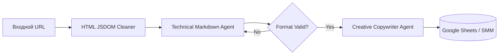

# ai-content-factory-jsdom


# AI Content Factory: Экономия 50x на токенах через пре-парсинг


## 📌 1. О проекте  
**Какую проблему решаем?** 
Медиа-агентства и SMM-отделы тратят огромные бюджеты на автоматизацию: если отправлять ссылку на крупную статью в ИИ напрямую, нейросеть «съедает» тысячи рублей только на чтение невидимого веб-кода (рекламы, меню, скриптов), из-за чего юнит-экономика контента становится убыточной.

**Что делает этот проект:** 
Это промышленный конвейер переработки контента. Прежде чем отправить статью в платную нейросеть, система специальным программным фильтром «срезает» с сайта весь мусор, оставляя только чистый текст. Затем два узкоспециализированных ИИ-агента превращают эту выжимку в яркий пост для соцсетей, который автоматически сохраняется в таблицу.


## 📊 Бизнес-результаты и Метрики
| Метрика | При прямой подаче | С архитектурой очистки | Бизнес-эффект |
| :--- | :--- | :--- | :--- |
| **Стоимость токенов/статья** | ~150,000 токенов | ~3,000 токенов | **Экономия в 50 раз** |
| **Производительность** | 3-5 постов в день | 100+ постов в час | **Масштабирование без ФОТ** |
| **ROI системы** | Низкий (дорогой API) | Окупаемость за 14 дней | **ИИ генерирует прибыль** |

## 🏗 Бизнес-контекст и Ограничения
*   **Ситуация:** Необходимость массовой переработки лонгридов из СМИ в адаптированный SMM-контент.
*   **Ограничения:** Отправка сырого URL в LLM сжигает бюджет из-за избыточности HTML-кода (меню, реклама, JS скрипты).
*   **Инженерный вызов:** Создание алгоритма фильтрации данных «на лету», который удаляет 98% технического мусора до этапа тарификации в AI-модели.

**Executive Summary:**  
Масштабируемый конвейер генерации SMM-контента из тяжелых веб-источников со снижением OPEX на API на 98%.

---

## 🔒 2. Статус проекта и Развертывание (NDA)

> **⚠️ NDA Status:** Исходный код пайплайна и корпоративные промпты защищены NDA. В репозитории представлена архитектура оптимизации затрат (FinOps).

**Оптимизация DOM-дерева (Sanitized Snippet):**
Секрет 50-кратной экономии заключается в использовании ноды `HTML Extract` до обращения к LLM. Использование CSS-селекторов позволяет игнорировать 98% веса страницы.

```json
// Пример конфигурации экстрактора n8n
{
  "extractionValues": {
    "article_body": "div.post-content, article.main-text > p",
    "article_title": "h1.title"
  },
  "returnArray": false,
  "stripTags": true // Критически важно: удаляет все HTML-теги перед отправкой в LLM
}
```
## 🛠 3. Стек технологий  

**n8n (Orchestrator):**
Визуализирует потоки данных и позволяет настраивать триггеры по расписанию (Cron) или по появлению новой ссылки в таблице.
**JSDOM / HTML Extract:**  
Выполняет «черновую» работу бесплатно, сокращая объем входящего текста со 150 000 токенов до 3 000.  
**OpenRouter API:**  
Единый шлюз, позволяющий использовать лучшие модели (Claude/Gemini) для креативного копирайтинга.  
**Multi-Agent Architecture:**  
Разделение ролей. Технический агент форматирует текст в Markdown, Креативный агент пишет пост по Tone of Voice. Это исключает смешение задач и сбои в разметке.


## ⚙️ 4. Техническая архитектура
Архитектура Multi-Agent. Технический ИИ отвечает за жесткое Markdown-форматирование, а Креативный ИИ — за соблюдение Tone of Voice бренда.



## 🛡 5. Безопасность и Изоляция данных**
Очистка контента (парсинг) происходит на локальном сервере. Внешний ИИ получает только «чистый» текст статьи без корпоративных метаданных.
> 🗣 Мнение СЕО медиа-агентства: "Раньше счет за API рос пропорционально постам. После того как Денис внедрил пре-парсинг страниц, расходы упали со средних $500 до $10 в месяц. Теперь мы масштабируемся без оглядки на бюджет."

## 📸 6. Доказательства работы (Proof of Work)
<p align="center">

<br>
<i>Рис 1. Пайплайн пре-процессинга данных: узел HTML Extract срезает 98% "мусорного" веб-кода до тарификации в LLM.</i>
</p>
<p align="center">

<br>
<i>Рис 2. Автоматическая агрегация и выгрузка готового SMM-контента в корпоративную базу данных.</i>
</p>

**🤝 Как мы можем сотрудничать?**
- ✅ Построю автономный конвейер переработки контента.
- ✅ Проведу аудит ваших текущих ИИ-решений и срежу затраты на API.
- ✅ Внедрение через Shadow Mode (тестируем параллельно с текущими процессами).
  
**Связаться для аудита:** Telegram @dks_persistent_bot  
*(Работа по договору, NDA, DPA)*
