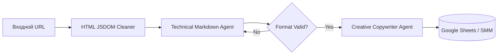

# ai-content-factory-jsdom


# AI Content Factory: Экономия 50x на токенах через пре-парсинг


**Executive Summary:** Масштабируемый конвейер генерации SMM-контента из тяжелых веб-источников со снижением OPEX на API на 98%.

## 📊 1. Бизнес-результаты и Метрики
| Метрика | При прямой подаче | С архитектурой очистки | Бизнес-эффект |
| :--- | :--- | :--- | :--- |
| **Стоимость токенов/статья** | ~150,000 токенов | ~3,000 токенов | **Экономия в 50 раз** |
| **Производительность** | 3-5 постов в день | 100+ постов в час | **Масштабирование без ФОТ** |
| **ROI системы** | Низкий (дорогой API) | Окупаемость за 14 дней | **ИИ генерирует прибыль** |

## 🏗 2. Бизнес-контекст и Ограничения
*   **Ситуация:** Необходимость массовой переработки лонгридов из СМИ в адаптированный SMM-контент.
*   **Ограничения:** Отправка сырого URL в LLM сжигает бюджет из-за избыточности HTML-кода (меню, реклама, JS скрипты).
*   **Инженерный вызов:** Создание алгоритма фильтрации данных «на лету», который удаляет 98% технического мусора до этапа тарификации в AI-модели.

## ⚙️ 3. Техническая архитектура
Архитектура Multi-Agent. Технический ИИ отвечает за жесткое Markdown-форматирование, а Креативный ИИ — за соблюдение Tone of Voice бренда.



**🛡 4. Безопасность и Изоляция данных**
Очистка контента (парсинг) происходит на локальном сервере. Внешний ИИ получает только «чистый» текст статьи без корпоративных метаданных.
> 🗣 Мнение СЕО медиа-агентства: "Раньше счет за API рос пропорционально постам. После того как Денис внедрил пре-парсинг страниц, расходы упали со средних $500 до $10 в месяц. Теперь мы масштабируемся без оглядки на бюджет."

**🤝 Как мы можем сотрудничать?**
- ✅ Построю автономный конвейер переработки контента.
- ✅ Проведу аудит ваших текущих ИИ-решений и срежу затраты на API.
- ✅ Внедрение через Shadow Mode (тестируем параллельно с текущими процессами).
  
**Связаться для аудита:** Telegram @dks_persistent_bot  
*(Работа по договору, NDA, DPA)*
```
